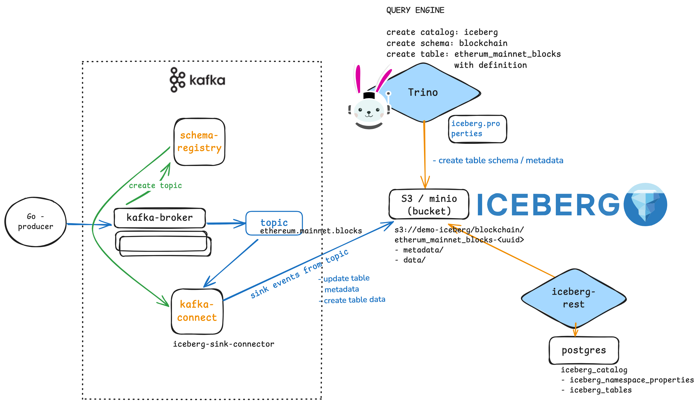

# Iceberg Kafka Connect Example

## Introduction
Apache Iceberg is the open table format that is high-performant for analytic tables. It supports SQL tables, while also supports 
various data engines like Spark, Flink, Trino, Hive, Presto and etc. It is an improvement to the first generation of table format Apache Hive, 
and is siblings with the contemporary Apache Hudi and Delta lake standards. Featuring:
* ACID Transaction
* Schema Evolution 
* Hidden Partition 
* Time Travel and Rollback

This example demonstrates Iceberg rest service and Iceberg table with Trino. 
Data is produced to Kafka, and sink into the Iceberg - Trino table via the Kafka connector. 
https://substack.com/home/post/p-137733070?source=queue


## Starting the environment

### Minio

This is a S3 compatible storage that is used as the object store to host the data and its metadata
https://blog.min.io/a-developers-introduction-to-apache-iceberg-using-minio/
It has a UI that can be accessed at `http://localhost:9000` 

the login credentials are configured in the `docker-compose.yml` file

In the UI, in the user browser, you should see 1 bucket called `demo-iceberg`


### Trino

This will mount the `iceberg.properties` file into `/etc/trino/catalog/`  in the trino container.
This file is a `catalog` config that configures the trino iceberg connector.

Trino looks for catalogs in `/etc/trino/catalog/`.

There is a trino UI at `http://localhost:8080` the login is `admin`

### Iceberg Rest Catalog

This is a rest catalog that is used to manage/store meta information about the iceberg tables.
it is backed by a `postgres` database.

There are other alternatives, such as: `nessie`, `hivemetastore` etc

### Kafka

For simplicity, we use a 1 node cluster for the demo topic. Note that currently only one sink connector can be used if we would like to have guaranteed exactly-once control. 
- Kafka broker (cluster)
- Schema Registry + UI
- Kafka Connect + UI
The Kafka Connect image is built from the `Dockerfile` to have the Iceberg Sink Connector binary


## Setup the environment
### Create the Iceberg table

You can connect to trino in any way you like. Here is an example using the trino-cli.
see https://trino.io/docs/current/client/cli.html

```bash
trino http://localhost:8080
```
Verify the connection between trino and iceberg: 
```sql
trino > show catalogs;

# verify that the icerberg catalog is present
 Catalog 
---------
 iceberg 
 jmx     
 memory  
 system  
 tpcds   
 tpch    
(6 rows)
```

Then, let's create the db schema
```sql
create schema iceberg.blockchain;
```

then the table, with definitions. 
Note that the file format is default to `PARQUET` as configured in the trino-iceberg connector

```sql
create table iceberg.blockchain.ethereum_mainnet_blocks(
        number BIGINT,
        hash VARCHAR,
        parent_hash VARCHAR,
        gas_used BIGINT,
        timestamp TIMESTAMP(6)
)
WITH (
    partitioning = ARRAY['day(timestamp)'],
    sorted_by = ARRAY['number']
    );
```
you can check the table by running `show tables from iceberg.blockchain;`

This should also create the initial metadata in the S3 bucket, in the path of db schema and table name


exit from the trino-cli by running `exit;`


### Create the topic
Create the topic `ethereum_mainnet_blocks` and start the producer. Note that the topic name has to be consistent with the table name in iceberg
```shell
kafka-topics --bootstrap-server localhost:9092 --topic ethereum.mainnet.blocks --partitions 1 --replication-factor 1 --create
```

### Adding the Kafka Connector
Open the Kafka Connect UI on `http://localhost:8000` and click on `New` to add a new connector.

You should see `IcebergSinkConnector` in the list of available connectors.

paste in values from `connector.json` and click `Create`

Note that The Kafka iceberg-sink-connector uses a control topic to guarantee exactly-once semantics. by default, it uses the topic called control-iceberg.
```shell
 % kafka-topics --bootstrap-server localhost:9092 --list                                                                             
__consumer_offsets
__transaction_state
_connect_configs
_connect_offset
_connect_status
_schemas
control-iceberg
ethereum.mainnet.blocks

```

## Produce the data to Kafka

```bash
go run main.go
```

Now we should get data persisted in Minio, also queryable via Trino! 


Iceberg tables are tracked in postgres


# Next steps
###Connect to Grafana to visualize data
### CDC into iceberg
